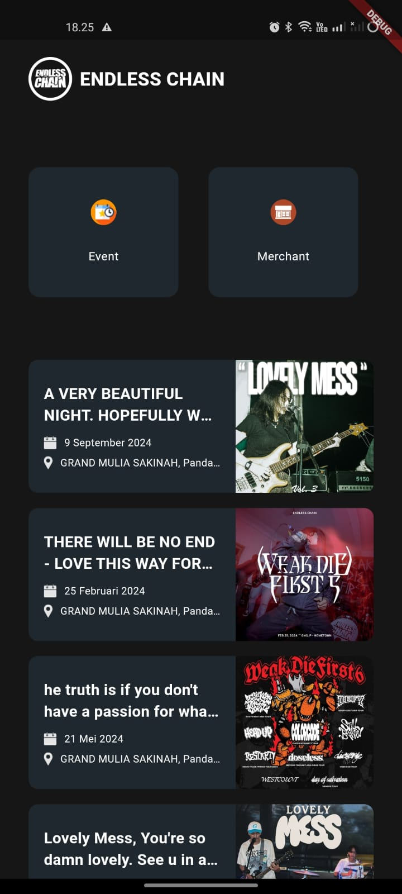
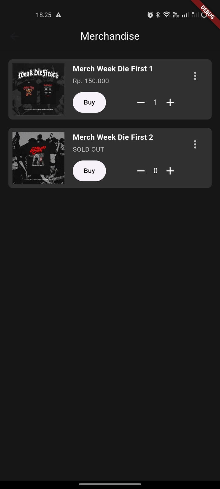
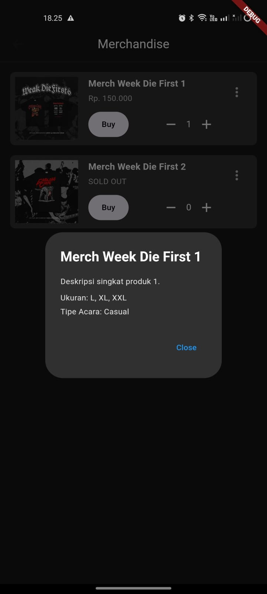

# EC4EVA

**EC4EVA** adalah aplikasi Flutter yang dirancang untuk menyajikan berbagai event musik dan merchandise terkait dengan grup musik *Endless Chain*. Melalui aplikasi ini, pengguna dapat melihat daftar event yang akan datang, mendapatkan informasi mengenai merchandise yang tersedia, dan melakukan pembelian atau reservasi. EC4EVA memungkinkan pengguna tetap terhubung dengan dunia musik melalui berbagai event menarik.

## Fitur Aplikasi
- **Menampilkan Event dan Merchandise**: Menyediakan daftar event musik dan merchandise yang berhubungan dengan *Endless Chain*.
- **Daftar Produk**: Pengguna dapat melihat produk-produk seperti kaos, poster, dan aksesori grup musik.
- **Integrasi Pembelian**: Mengarahkan pengguna ke WhatsApp untuk mempermudah proses pembelian.

## Tampilan Aplikasi

### Halaman 1: Beranda
Halaman utama aplikasi yang menyajikan informasi singkat tentang grup musik *Endless Chain* dan event-event yang akan datang. Terdapat tombol navigasi yang memudahkan pengguna mengakses berbagai bagian aplikasi.


### Halaman 2: Menu Utama
Halaman ini berfungsi sebagai navigasi utama, dengan beberapa opsi seperti melihat daftar event, mengecek merchandise, atau mengakses pengaturan aplikasi.



### Halaman 3 - 5: Merchandise
Menampilkan berbagai produk seperti kaos, poster, dan aksesori grup musik *Endless Chain*. Setiap produk disertai gambar dan deskripsi singkat.





## Instalasi

Untuk menjalankan aplikasi secara lokal, ikuti langkah-langkah berikut:

1. **Clone** repositori ini:
   ```bash
   git clone https://github.com/username/EC4EVA.git
   cd EC4EVA
2. **Install dependensi**:
   ```bash
   flutter pub get
2. **Jalankan aplikasi**:
   ```bash
   flutter run
